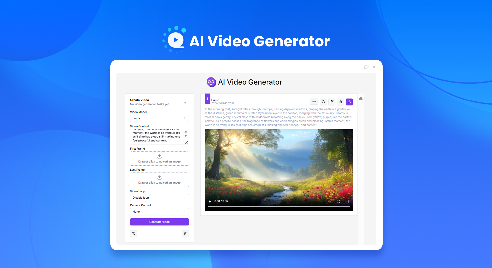

# 
🎬 AI Video Generator 🚀✨

The AI video generator creates high-quality AI videos based on texts and pictures through industry-leading video large models such as Luma, Runway gen-3, Kling Keling, and CogVideoX Zhipu.

<a href="README zh.md">中文</a> | <a href="README.md">English</a> | <a href="README_ja.md">日本語</a>

This is the open-source version of the [AI Video Generator](https://302.ai/tools/vgen/) from [302.AI](https://302.ai). You can log in directly to 302.AI, use the online version with zero code and zero background, or modify and deploy it according to your needs.

## Interface Preview
AI generates videos using the selected models based on the input descriptions.

## Project Features

### 🎥 AI Video Generator
It supports multiple models for generating videos from pictures and can quickly generate customized videos.
### 🖼️ Local Image Cropping
It supports generating videos after cropping local images.
### 🔄 Task Management
Video tasks support regeneration and video expansion for further editing.
### ⚙️ Multi-Model Support
Offers different configuration options for different models, including lens control and video effects.
### 📜 History Record
Saves your creation history, ensuring memories aren't lost and available for download anytime.
### 🌓 Dark Mode
Switch as you like to protect your eyes.
### 🌍 Multi-language Support
- Chinese Interface
- English Interface
- Japanese Interface

## 🚩 Future Update Plans 
- [ ] Provide a wider range of video style options and allow users to conduct more refined personalized style control
- [ ] Cross-model fusion and model performance optimization

## Technology Stack

- Next.js 14 Base Framework
- Tailwind CSS + Shadcn UI for Styling
- Zod + react-hook-form for Form Handling
- Zustand for Data Management

## Development & Deployment

1. Clone the project `git clone git@github.com:302ai/302_video_generator.git`
2. Install dependencies `pnpm install`
3. Configure 302’s API KEY as per .env.example
4. Run the project `pnpm dev`
5. Build and deploy `docker build -t video-generator . && docker run -p 3000:3000 video-generator`

## ✨ About 302.AI ✨

[302.AI](https://302.ai) is a pay-as-you-go AI application platform that addresses the last-mile problem of AI in practice.

1. 🧠 It integrates the latest and most comprehensive AI capabilities and brands, including but not limited to language models, image models, sound models, and video models.
2. 🚀 We conduct deep application development on basic models, creating real AI products rather than simple chatbots.
3. 💰 No monthly fees, all features are pay-as-you-go, fully open, truly low barrier with high potential.
4. 🛠 Powerful management backend for teams and small to medium enterprises; one person manages while multiple people use.
5. 🔗 All AI capabilities provide API access, and all tools are open source and customizable (ongoing).
6. 💡 A strong development team releases 2-3 new applications weekly, with products updated daily. Developers interested in joining are welcome to contact us.
