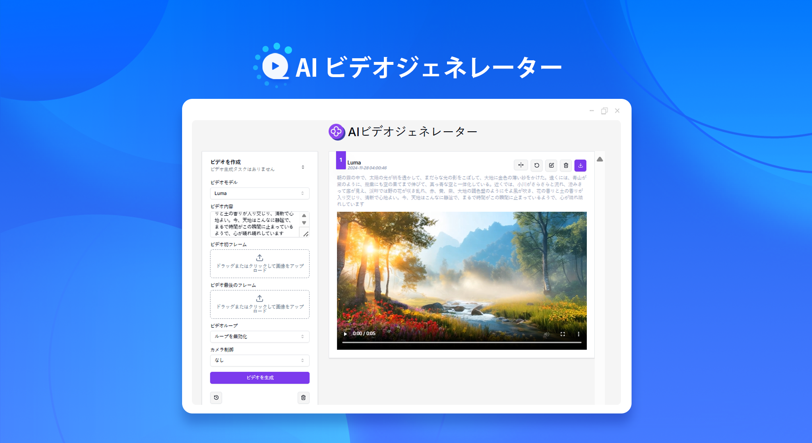

# 
🎬 AI ビデオジェネレーター 🚀✨

AI ビデオ生成器は、テキストと画像を元に、ルマ（Luma）、ランウェイ・ジェン 3（Runway gen-3）、クリング・ケリング（Kling Keling）、コグビデオ X 智譜（CogVideoX Zhipu）などの業界をリードするビデオの大規模モデルを通じて、高品質の AI ビデオを生成します。

<a href="README_zh.md">中文</a> | <a href="README.md">English</a> | <a href="README_ja.md">日本語</a>

これは[302.AI](https://302.ai/ja/)による[AIビデオジェネレーター](https://302.ai/ja/tools/vgen/)のオープンソース版です。302.AIに直接ログインしてコード不要でオンライン版を利用するか、ニーズに合わせて修正して自分でデプロイできます。

## インターフェースプレビュー
AI は入力された説明に基づき、選択したモデルを使用してビデオを生成する。

## プロジェクトの特性

### 🎥 AIビデオジェネレーター
画像からビデオを生成するための複数のモデルをサポートし、迅速にカスタマイズされたビデオを生成できます。
### 🖼️ ローカル画像の切り取り
ローカル画像を切り取った後にビデオを生成することをサポートしています。
### 🔄 タスク管理
ビデオタスクは再生成とビデオ拡張による再度の編集をサポートしています。
### ⚙️ 多数のモデルサポート
異なるモデルに基づいた異なる設定オプションを提供、カメラコントロールやビデオエフェクトなどを含む。
### 📜 履歴記録
あなたの創作履歴を保存し、記憶が失われることがなく、いつでもどこでもダウンロードすることができます。
### 🌓 ダークモード
好きなように切り替えることができ、あなたの目を保護します。
### 🌍 多言語サポート
中国語インターフェース
英語インターフェース
日本語インターフェース

## 🚩 将来のアップデート計画
- [ ] より豊富なビデオスタイルのオプションを提供し、ユーザーにより細かい個性化されたスタイル制御を行うことを許可します
- [ ] モデル間の融合とモデル性能の最適化

## 技術スタック

- Next.js 14 基礎フレームワーク
- Tailwind CSS + Shadcn UI スタイルUI
- Zod + react-hook-form フォーム処理
- Zustand をデータ管理に使用

## 開発&デプロイ

1. プロジェクトをクローン `git clone git@github.com:302ai/302_video_generator.git`
2. 依存関係をインストール `pnpm install`
3. 302のAPI KEYを設定 環境ファイルを参照.env.example
4. プロジェクトを実行 `pnpm dev`
5. パッケージデプロイ `docker build -t video-generator . && docker run -p 3000:3000 video-generator`

## ✨ 302.AIの紹介 ✨

[302.AI](https://302.ai)は企業向けのAIアプリケーションプラットフォームであり、必要に応じて支払い、すぐに使用できるオープンソースのエコシステムです。✨

1. 🧠 最新かつ完全なAI能力とブランドを集約しており、言語モデル、画像モデル、音声モデル、ビデオモデルを含めます。
2. 🚀 基本モデルを用いた深度応用開発を行い、単なる会話型ロボットではなく真のAI製品を開発しています。
3. 💰 月額費不要で、すべての機能はオンデマンドで課金され、門戸は低く、上限は高い。
4. 🛠 強力な管理バックエンドを備え、チームや中小企業向けに、一人が管理し複数人が利用可能。
5. 🔗 すべてのAI能力はAPI接続を提供し、すべてのツールはオープンソースでカスタマイズ可能（進行中）。
6. 💡 強力な開発チームで、毎週2-3の新しいアプリケーションをリリース、製品は毎日更新。開発者の参加も歓迎します。
